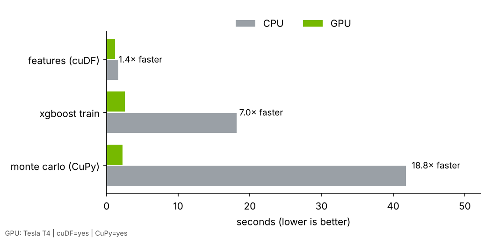
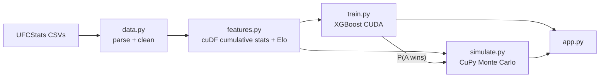

# Octagon Odds: GPU-accelerated UFC fight prediction

A UFC fight pricing engine. Pick two fighters and it gives each one's win probability, **how** (KO, submission, decision) and **when** (by round) the fight ends, each fighter's **strength of schedule**, and a full **sportsbook-style odds board**: moneyline, method of victory, round betting, total rounds, and goes the distance. Every price shows its fair odds and a book price with margin. Under the hood:

| Stage | NVIDIA tech | What it does |
|---|---|---|
| Feature engineering | **RAPIDS cuDF** | Per-fighter career aggregates over 17k+ fighter-fights × 30 stat columns, leak-free (each fight only sees earlier fights) |
| Ratings | Glicko-2 + Elo | Rating systems with uncertainty that grows during layoffs, run fight by fight |
| Win models | **XGBoost on CUDA** + logistic regression | Gradient-boosted trees (GPU) and a regularised logistic model, blended by a stacked ensemble |
| Fight simulator | **CuPy** | Round-by-round Monte Carlo with millions of simulated fights per matchup, batched across matchups on the GPU |
| Pricing | `odds.py` | Fair odds → margin (power or multiplicative) → American/decimal; de-vig a real line and compute EV |
| App | Streamlit | Prediction, odds board, strength of schedule, model breakdown, and a page of the actual formulas |

Every module falls back to pandas/NumPy/CPU automatically (`mmapred/backend.py`), so the app also runs on a laptop with no NVIDIA GPU.

## Results (held-out test set: every UFC fight from Jan 2024 to Oct 2026)

Strict chronological split: train on 2001–2022, tune on 2023, test once on 2024+.

| Win model | Accuracy | Log loss | Brier | AUC |
|---|---|---|---|---|
| **Stacked ensemble** | **65.3%** | **0.632** | **0.221** | **0.692** |
| Logistic regression | 64.5% | 0.633 | 0.221 | 0.693 |
| XGBoost (CUDA) | 64.6% | 0.638 | 0.224 | 0.682 |
| Glicko-2 alone | 57.2% | 0.679 | 0.243 | 0.592 |
| Elo alone | 55.7% | 0.677 | 0.242 | 0.586 |
| Coin flip | 50.0% | 0.693 | 0.250 | 0.500 |

The ensemble weights (fit on 2023 only) are XGBoost +0.63, logistic regression +0.51, Glicko-2 −0.08. Glicko's information is already inside the other two models' features, so the stack ignores it.

**Strength of schedule helps.** Removing the SOS features raises test log loss from 0.638 to 0.642 for XGBoost and from 0.633 to 0.636 for logistic regression. That's a small, consistent gain, and the size you'd expect from one feature group in a noisy sport.

| Simulator (finish vs decision) | Value |
|---|---|
| Brier, simulator | 0.236 |
| Brier, always predict the base rate | 0.250 |
| AUC for "does it end early" | 0.64 |
| Predicted vs actual finish rate | 50.4% vs 50.2% |
| Most likely method correct | 54.3% (always guessing "decision": 49.8%) |

For context, closing betting lines pick the winner roughly 65–70% of the time. Getting into that range from public stats alone is the realistic target.

## CPU vs GPU benchmarks

Measured on a free Google Colab **Tesla T4** (`benchmarks/run_all.py`; CPU = the Colab VM's CPU, GPU timings after one warm-up run).

| Stage | Workload | CPU | GPU (T4) | Speedup |
|---|---|---|---|---|
| Monte Carlo (CuPy) | 4,950 matchups × 20k sims = **99M simulated fights** | 41.7 s | 2.2 s | **18.8×** |
| XGBoost train (CUDA) | 140k rows × 42 features (v1 feature set), 500 trees | 18.2 s | 2.6 s | **7.0×** |
| Features (cuDF) | 357k fighter-fight rows, grouped cumulative stats | 1.6 s | 1.2 s | 1.4× |

The simulator is fully parallel (every matchup × every simulated fight is independent), so it gains the most. Feature engineering is a small table, which is about the size where cuDF only starts to break even: transfer and kernel launch overhead eat most of the gain. A GPU only pays off once there's enough parallel work.



## How it works



**Leak-free features.** For every fight, a fighter's stats come only from their *earlier* UFC fights: strikes landed and absorbed per minute, accuracy, defense, takedowns, control time, knockdowns, KO/sub rates per round, recent form, Elo, age, reach, and layoff. Small samples are shrunk toward the league average, so a fighter with two fights doesn't get extreme numbers.

**Strength of schedule.** Using each opponent's Elo *at the time of the fight*, every fighter gets: the average opponent rating (SOS), the average rating of opponents beaten (quality of wins) and lost to, the number of wins over 1600+ rated opponents, and **opponent-adjusted** striking and wrestling. Opponent-adjusted means strikes landed per minute minus what that opponent usually absorbs, so 5 strikes/min against elite defense counts for more than 5 strikes/min against weak defense.

**Ratings.** Elo plus Glicko-2. Glicko-2 tracks a rating deviation that grows while a fighter is inactive and shrinks with each fight, so long layoffs and short careers pull predictions toward 50%.

**Models and ensemble.** A regularised logistic regression on ~55 standardised stat and SOS differences, plus XGBoost for non-linear interactions. A second logistic regression with no intercept blends their log-odds with Glicko-2, and its weights are fit on 2023 only. Leaving out the intercept keeps P(A beats B) = 1 − P(B beats A).

**Corner bias.** UFCStats usually lists the winner first (5,625 vs 3,167 fights). Training on each fight from both corners, and averaging both orientations at prediction time, stops the model from learning "first name wins" and guarantees P(A beats B) = 1 − P(B beats A).

**Simulator.** In each round, each fighter has a KO hazard (their KO power × the opponent's KO vulnerability) and a submission hazard. Every simulated fight also draws a random "form" multiplier per fighter, and hazards rise slightly in later rounds. Fights that go the distance go to the judges, who favour the model's pick. Each fighter's outcomes are then rescaled so the total win probability equals the ensemble's exactly. The ensemble decides *who* wins; the simulator adds *how* and *when*. The three simulator settings were tuned on 2023 fights only.

**Pricing like a sportsbook.** Each market's fair probabilities are converted to odds, then margin is added so implied probabilities sum to 100% + overround. The default is the **power method** (qᵢ = pᵢᵏ), which puts proportionally more margin on longshots, in line with the favourite-longshot bias seen in betting markets. Multi-way markets (method of victory, round betting) carry more margin, as they do at real books. You can also paste a real moneyline: the app de-vigs it to the book's fair probability and shows the model's edge and EV. Real books also move lines on betting volume and injury/camp news; this engine models the opening number.

## Run it

**On Colab (GPU):** open `notebooks/colab_gpu_run.ipynb`, set the runtime to T4 GPU, and run all cells. It trains, evaluates, benchmarks, and lets you download `artifacts/`.

**Locally (CPU is fine for the app):**

```bash
pip install -r requirements.txt          # Mac: brew install libomp first
python -m mmapred.train                  # downloads data, trains, writes artifacts/
python -m mmapred.evaluate               # simulator check on 2024+ fights
streamlit run app.py
python -m mmapred.predict "Islam Makhachev" "Ilia Topuria" --rounds 5
```

## Known limitations

- Public stats only: no betting odds, injuries, weight cuts, or camp changes.
- Fighter names are the join key; a few fighters share names on UFCStats.
- Calibration is decent but not perfect: in the 0.7–0.8 bucket, favourites won 80% of the time.
- x.5 round totals assume a finish is equally likely at any moment within a round.
- Stoppages listed as injuries (e.g. a knee giving out) are excluded from KO stats, but other fluke stoppages still count as KOs.
- Only UFC fights count, so prospects coming from other promotions start with few stats.

## Next steps

- [ ] Compare against closing betting odds (needs an odds dataset).
- [ ] Feed real closing lines in as a feature and as a benchmark to beat.
- [ ] Computer vision: pose estimation on fight footage with **TensorRT** to count strikes from video.
- [ ] Serve the model with **NVIDIA Triton Inference Server**.

Data: [Greco1899/scrape_ufc_stats](https://github.com/Greco1899/scrape_ufc_stats) (a mirror of UFCStats.com). For fun and learning, not betting advice.
